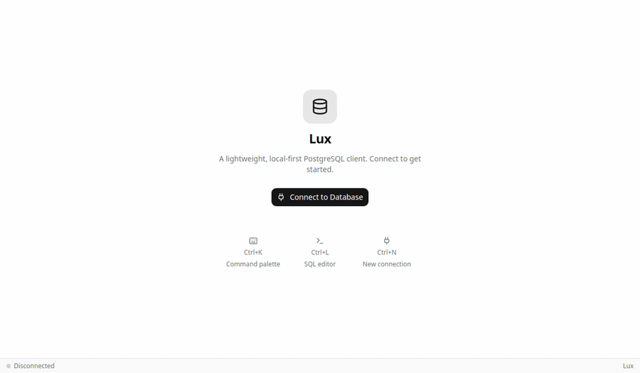
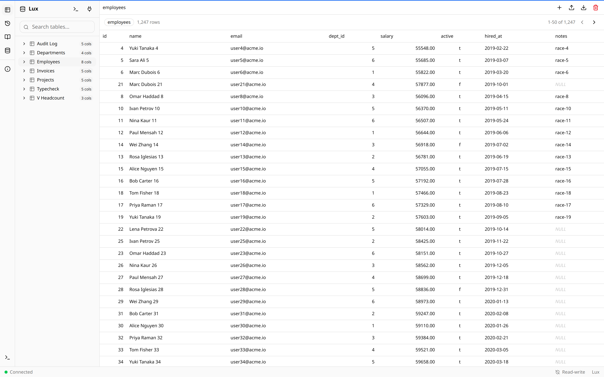
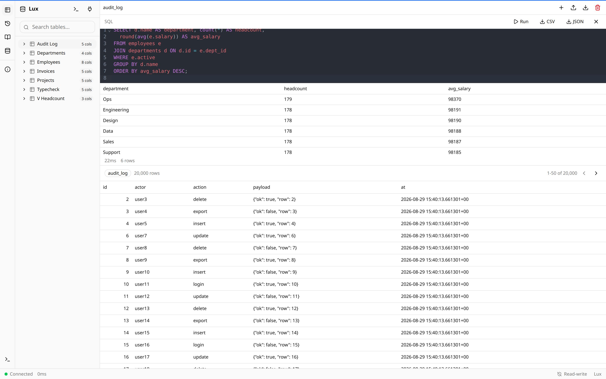
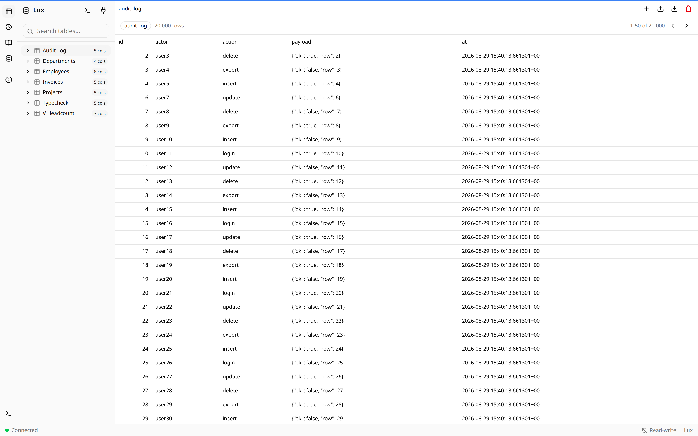
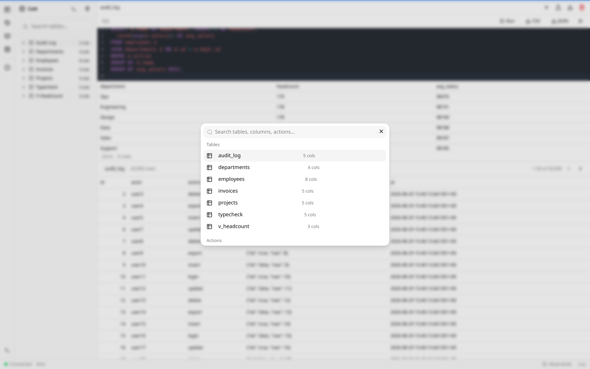

<p align="center">
  
</p>

<h1 align="center">Lux</h1>

<p align="center">
  A lightweight, local-first PostgreSQL web client.
  <br />
  Single binary. Zero install. Modern UI compiled into one ~1.4 MB Zig executable. No Electron, no JVM, no Python.
</p>

<p align="center">
  <a href="LICENSE"></a>
  <a href="https://ziglang.org"></a>
</p>

<p align="center">
  
</p>

## Why Lux?

Every PostgreSQL GUI is either bloated, expensive, or drags in a JVM.
Lux compiles to a **~1.4 MB binary** (ReleaseSmall) that serves a full web UI from memory.
No Electron, no Python, and no PostgreSQL client library: the wire protocol is spoken in
pure Zig, so `ldd` shows nothing but libc. Download it and run it.

<p align="center">
  
</p>

| | Lux | pgAdmin | DBeaver | TablePlus | Beekeeper Studio |
|---|---|---|---|---|---|
| **Price** | Free (MIT) | Free | Free / $12/mo | $89 | Free / $7/mo |
| **Runtime deps** | None (libc) | Python, JS | JVM | None | Electron |
| **Privacy** | Fully local | Local | Telemetry | License check | Telemetry |

Table browser, SQL editor with autocomplete, CSV/JSON export, CSV import,
pending-edit journal, command palette, dark/light themes, read-only mode.
<details>
<summary><b>More screenshots</b></summary>

<br />

**Table browser** — schema tree, 1,247 rows, typed column alignment.



**SQL editor** — CodeMirror 6 with autocomplete, results inline.



**JSON/JSONB columns** rendered as stored.



**Command palette** — Ctrl+K.



</details>

## Install

Download the binary for your platform from the
[latest release](https://github.com/berkemuftuoglu/lux/releases/latest), make it
executable, and run it:

```bash
chmod +x lux-* && ./lux-*
```

Then open <http://127.0.0.1:8080>.

There is nothing else to install — no libpq, no runtime, no client library.

```
./lux              # default: 127.0.0.1:8080
./lux -p 3000      # custom port
./lux -b 0.0.0.0   # bind all interfaces
```

Works with any PostgreSQL — local, remote, or cloud (RDS, Supabase, Neon).

<details>
<summary>Build from source</summary>

<br />

Requires [Zig 0.15.2+](https://ziglang.org/download/). No system libraries, no headers.

```bash
git clone https://github.com/berkemuftuoglu/lux.git
cd lux
zig build -Doptimize=ReleaseSmall
./zig-out/bin/lux
```

`-Doptimize=ReleaseSafe` gives a build with safety checks (~6 MB vs ~1.4 MB).

</details>

<details>
<summary>Docker</summary>

<br />

```bash
docker build -t lux .
docker run -p 8080:8080 lux
```

</details>

<details>
<summary>Unsigned binaries — first-run friction on macOS and Windows</summary>

<br />

Binaries are not code-signed yet. One-time workaround:

- **macOS** — Gatekeeper refuses to open it. Run `xattr -d com.apple.quarantine ./lux-*` once.
- **Windows** — SmartScreen shows "Windows protected your PC". Click **More info** → **Run anyway**.
- **Linux** — none; it runs after `chmod +x`.

</details>

## Contributing

See [CONTRIBUTING.md](CONTRIBUTING.md). All three build gates must pass:

```bash
zig build test                      # 127 Zig unit tests
zig build -Doptimize=ReleaseSafe    # release build succeeds
zig build lint                      # zlint + zig fmt + biome
```

Frontend type-check and unit/component tests:

```bash
cd frontend && pnpm run check && pnpm test   # svelte-check + 15 vitest tests
```

End-to-end smoke (Playwright, 24 user flows) against a live Postgres:

```bash
cd e2e && npm test
```

## Security

See [SECURITY.md](SECURITY.md) for the threat model and disclosure policy. Short version: Lux is local-first, binds to 127.0.0.1 by default, and trusts the local user.

## License

MIT — see [LICENSE](LICENSE).
